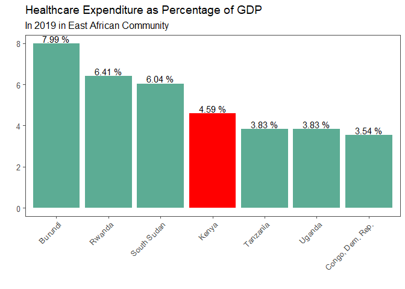

Health Expenditure % GDP
================
David Andai
10/15/2022

When trying to figure out how to allocate our financial resources, we
more often than not asses our expenses so as to develop a budget. Some
items on the budget list end up having a bigger share of the portion
depending on our various priorities. When it comes to matters health at
a National level, we use the Current Health Expenditure as a share of
GDP to provide an indication on the level of resources channeled to
health relative to other uses.

But what is GDP? Gross domestic product (GDP) is the standard measure of
the value added created through the production of goods and services in
a country during a certain period. (IMAGE)

As GDP factors in the National outlook of the economy, health spending
measures the final consumption of health care goods and services
(i.e. current health expenditure). This includes personal health care
(curative care, rehabilitative care, long-term care, ancillary services
and medical goods) and collective services (prevention and public health
services as well as health administration), but excluding spending on
investments (OECD 2022).

Health Expenditure as percentage of GDP Data

``` r
##Data Visualization of HE $ of GDP in 2019
plot1 <- ggplot(ea_gdp_19,
       aes(x = reorder(country_name,-x2019), y= x2019, fill = reorder(country_name,-x2019)))+
  geom_bar(stat = 'identity',show.legend = FALSE)+
  scale_fill_manual(values = c("Kenya" = "#FF0000",
                               "Tanzania" = "#5cac94",
                               "Uganda" = "#5cac94",
                               "Rwanda"= "#5cac94", 
                               "Congo, Dem. Rep."= "#5cac94", 
                               "Burundi"= "#5cac94",
                               "South Sudan"= "#5cac94"))+
  theme_few()+
  theme(axis.text.x = element_text(angle = 45, hjust = 1))+
  geom_text(aes(label = paste(format(x2019, nsmall = 2), "%")), vjust = -0.2)+
  labs(title="Healthcare Expenditure as Percentage of GDP", 
        subtitle ="In 2019 in East African Community")+
  labs(x = "",
       y = "")
```

Health spending shows the importance of the health sector in the whole
economy and indicates the societal priority which health is given
measured in monetary terms (WHO). This analysis focuses how Kenya
compares to its neighbours in the East African Community. The latest
data entry is from 2019, while a look at a 10 year trend is assesd…….

``` r
plot1
```

<!-- -->

In 2019, health expenditure as a share of GDP for Kenya was 4.6 %.
Between 2010 and 2019, health expenditure as a share of GDP in Kenya was
decreasing on average by 2.44% each year, although before that, it grew
from 4.6 % in 2000 to 6.1 % in 2010.

``` r
#Data Visualization
myColours2 = c("#040c04", "#4d372c","#FF0000","#5cac94",
               "#24a4d4", "#ca5cdd","#4d3ec0")
plot2 <- ea_gdp2%>%
  mutate(isKenya = (country_name == "Kenya"))%>%
  ggplot(aes(x=years, y=gdp, color=country_name))+
  geom_line( aes (linetype = isKenya), size =1, alpha = 0.6)+
  labs (title = "East African Community Health Expenditure  (% of GDP)",
        y = "HE (% 0f GDP)",
        x = "",
        color = "Country")+
  scale_x_continuous(breaks = 2009:2019)+
  theme_few()+
  scale_linetype_manual(values = c ("dashed", "solid"), guide ="none")+
  scale_color_manual(values = myColours2)
```

``` r
plot2
```

<!-- --> Over the last
few years, there has been a strain on global economy following the
Covid-19 virus and now the Ukraine-Russia war. Such constraints forces
the governments to cut down on spending, including health spending.
